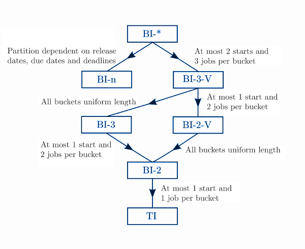
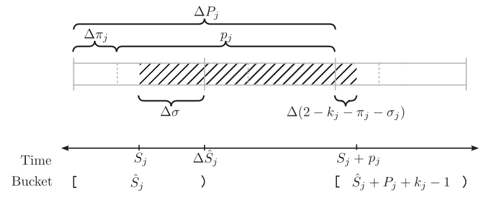
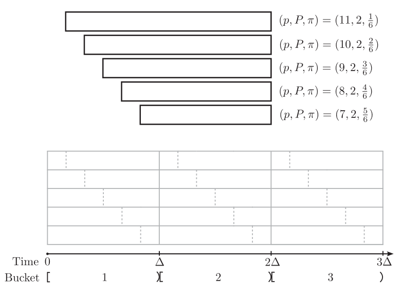

# Bucket Index Formulations for the Single Machine Scheduling Problem

The code in this repository provides implementations (with either PuLP or gurobipy) for Bucket Index (BI) formulations, and Time Index (TI) formulation for the (non-preemptive) Single Machine Scheduling Problem.

The single machine scheduling problem is a classical optimisation problem that has been extensively studied.  An instance of this problem consists of
$n$ jobs and a processing time $p_j$ for each job $j \in J = \{ 1, \ldots, n \}$. A schedule is a set of start times, or equivalently
completion times, for the jobs on a machine that is able to process no more than one job at a time. In the nonpreemptive version of the
problem, each job $j$ must receive uninterrupted processing for an interval of length $p_j$. The performance of a
schedule is typically evaluated against a standard min-sum or min-max criteria and there may exist additional restrictions on each job $j$
such as a release date $r_j$, a due date $d_j$, or a deadline $\bar{d}_j$.

The BI formulations provided in this repository are taken from 

[Clement, Riley. 
Mixed Integer Linear Programming Models for Machine Scheduling. 
PhD thesis.  University of Newcastle. 2015.](https://hdl.handle.net/1959.13/1310105)

and represent a family of MILP models of which all, but one, generalise the classic TI model:

  

The BI-2 model is a generalisation of the TI model to one in which at most two jobs can be processing in each time period.
The BI-3 model is a generalisation of the BI-2 model to one in which at most three jobs can be processing in each time period.
Like the TI model, these two BI models are an exact formulation that divides the planning horizon into time periods, which are referred to as buckets, of equal length. Unlike the TI model, the length of a
period is a parameter of the models.  For the BI-2 model the length of a period can be up to, and including, the processing time of the shortest job. For the BI-3 model the length of a period can be up to, and including, the sum of processing times of the two shortest jobs.

If the period is of unit length then the TI, BI-2 and BI-3 models are equivalent.
When longer periods are used, the BI models can have significantly fewer variables and nonzeros than
the corresponding TI model, at the expense of a greater number of constraints - the vast majority of which are
are tight simple variable bounds.

The BI-2-V and BI-3-V generalise the BI-2 and BI-3 models respectively to ones in which the buckets can be variable length. The bucket sizes must still be chosen to ensure at most two and three jobs respectively can be processed in each bucket, however release dates and deadlines can utilised to define how the upper bound on bucket size may change over the time horizon.

If certain conditions are satisfied then a BI-n model can be formulated in which a
bucket may permit an arbitrary number of jobs to start within it.

Finally, the BI-* model generalises all of the above models.  It is "a hybrid" of the BI-n, BI-3-V and BI-2-V models, in which each bucket in the time horizon belongs to one of three classes that differ according to the number of jobs permitted to start in the bucket.

### Install

Available as a python package `smsp_bi` which can be installed with pip:

    pip install git+https://github.com/venaturum/smsp_bucket_index_formulations

or with poetry (place the following dependency in pyproject.toml)

    smsp_bi = { git = "https://github.com/venaturum/smsp_bucket_index_formulations.git", rev = "main"}

Example usage can be found in *example.ipynb*.

## Models

The models are described below as they are presented in the thesis.  The implementation of these models in practice differs; scaling constraints and, in particular, avoiding coefficients that arise by division of bucket length to lower the risk of numerical issues in the solver.  Additionally, certain classes of redundant variables are not created.  Description of the subsequent models can be found [here](Implementations.md)

In the following models the problem data is integer and the length of the planning horizon is of sufficient length to admit a feasible schedule.

### TI Model

The classical time indexed (TI) integer linear programming model is one of the most well studied mixed integer linear programming formulations for nonpreemptive single machine scheduling problems. The problem data is assumed to be integer and a sufficiently large planning horizon is discretised into time periods of unit length. Binary variables, $x$ are defined for each job and each period to model whether or not the job starts at the beginning of the period.  The TI model's single biggest shortcoming is its size. The length of the planning horizon is pseudopolynomial in the size of the problem input, so for instances involving many jobs and long processing times, the TI model may be intractable due to its large number of variables and constraints.

In the TI model the planning horizon consists of $T$ periods in which period $t$ starts at time $t-1$ and ends at time $t$. Specifically, period $t$ corresponds to the right  half-open real interval $[t-1, t)$. 
The objective function is linear in the binary variables, with $c_{jt}$ being the cost incurred of starting job $j$ at the start of period $t$ (i.e. at time $t-1$).

For convenience, let $[t_1, t_2]$ denote the set $\{t_{1}, \ldots, t_{2}\} \cap \{1, \ldots , T\}$ of periods where the set $[t_{1}, t_{2}] = \emptyset$ if period $t_{1} > t_{2}$.

$$
\begin{alignat}{2}
  \text{min}\ & \sum_{j \in J} \sum_{t \in [1, T-p_j+1]} c_{jt} x_{jt},
  \\
  \text{s.t.}\ & \sum_{t \in [1, T-p_j+1]} x_{jt} = 1, & \quad & j \in
  J,
  \\
  & \sum_{j \in J} \sum_{s \in [t-p_j+1, t]} x_{js} \leq 1, & \quad &
  t \in [1, T],
  \\
  & x_{jt} \in \{0, 1\}, & \quad & j \in J,\ t \in [1, T-p_j+1].
\end{alignat}
$$

### BI-2 Model

For the BI models the planning horizon is divided into $B$ buckets of $\Delta$ periods such that $(B-1)\Delta < T \leq B\Delta$.  Specifically, bucket $b$ corresponds to the right half-open real interval $[(b-1)\Delta, b\Delta)$ that starts with period $(b-1)\Delta+1$ and ends with period $b\Delta$.  If $\tau \in [0, T)$ is an instant in time, then by definition time $\tau$ is contained in period $t = \lfloor \tau \rfloor + 1$ which lies in bucket $b = \lfloor \tau/\Delta \rfloor + 1$. 

A job is said to span $m$ buckets if its start time lies in the interval corresponding to bucket $b$ and its end time lies in the interval corresponding to bucket $b + m - 1$.  In the BI-2 formulation the length of each bucket $\Delta$ is chosen to be an integer number of periods no larger than the processing time of the shortest job.  Choosing a bucket size of this length ensures that each job spans at least two buckets, and at most one job can start in each bucket.

Let $P_j, \pi_j, D_j$ and $\delta_j$ be uniquely defined for each job $j$ by $p_j$ and $\Delta$, as follows:

$$
\begin{alignat}{4}
  & P_j & = & \lfloor p_j/\Delta \rfloor + 1, & \ & j \in J,\\
  & \pi_j & = & P_j - p_j/\Delta, & \ & j \in J,\\
  & D_j & = & \lfloor d_j/\Delta \rfloor + 1, & \ & j \in J,\\
  & \delta_j & = & D_j - d_j/\Delta , & \ & j \in J.
\end{alignat}
$$

In general, if a job $j \in J$ starts processing at time $s_j$ in bucket $S_j$ then it will complete processing at time $s_j + p_j$ in bucket $S_j + P_j + k_j - 1$ where $k_j \in \{0, 1\}$. The job will span $P_j + k_j$ buckets if and only if $1 - k_j < \sigma_j + \pi_j \leq 2 - k_j$. If $\sigma_j$ is the fraction of bucket $S_j$ used in processing the job then the fraction of bucket $S_j + P_j + k_j - 1$ used is $p_j/\Delta - \sigma_j - (P_j + k_j - 2) = 2 - k_j - \pi_j - \sigma_j \geq 0$.  

  

The BI-2 formulation is a mixed integer linear program with binary variables $z_{jbk}$ and continuous variables $u_{jbk}$ and $v_{jbk}$ for all jobs $j \in J$, buckets $b \in [1, B]$, and indices $k \in K = \{0, 1\}$.
If $z_{jbk} = 1$ then job $j$ starts in bucket $b$ and spans $P_j + k$ buckets, and $z_{jbk} = 0$ otherwise. In the grid shown below, a variable of this type is defined for each (job-dependent) part of a bucket enclosed by vertical lines (one dashed, one solid). So for each job in this example, there are six binary variables. For the second job (that with processing time 10), variable $z_{231}=1$ is defined to mean that this job starts in the first part of the third bucket, i.e. within the time interval $[12,14)$ while variable $z_{212}=1$ is defined to mean that this job starts in the second part of the first bucket, i.e. within the time interval $[2,6)$.

  

The variable $u_{jbk}$ denotes the fraction of bucket $b$ spent processing job $j$ if job $j$ were to start in bucket $b$ and span $P_j + k$ buckets, and $u_{jbk} = 0$ otherwise. Conversely, the variable $v_{jbk}$ denotes the fraction of bucket $b$ spent processing job $j$ if job $j$ were to complete processing in bucket $b$ and spanned $P_j + k$ buckets, and $v_{jbk} = 0$ otherwise. Recall that if job $j$ completes processing at time $(b-1) \Delta$ then by definition it completes processing in bucket $b$ and the fraction of bucket $b$ spent processing job $j$ is zero, that is, the variables $z_{j, b-P_j+1, 1} = 1$, $u_{j, b-P_j+1, 1} = 1 - \pi_j$, and $v_{jb1} = 0$.

#### Base formulation

$$
\begin{alignat}{2}
  \text{min}\ & \sum_{j \in J} \sum_{k \in K} \sum_{b \in [1, B]}
  c^z_{jb} z_{jbk} + c^u_{jb} u_{jbk} + c^v_{jb} v_{jbk},
  \\
  \text{s.t.}\ & \sum_{k \in K} \sum_{b \in [1, B]} z_{jbk} = 1, & \ &
  j \in J,
  \\
  & \sum_{j \in J} \sum_{k \in K} \sum_{a \in [b-P_j-k+2, b]} z_{jak}
  \leq 1, & \ & b \in [1, B],
  \\
  & \sum_{j \in J} \sum_{k \in K} (u_{jbk} + v_{jbk} +
  \sum_{\substack{a \in [b-P_j-k+2, \\ b-1]}} z_{jak}) \leq 1, & \ & b
  \in [1, B],
  \\
  & u_{jbk} + v_{j, b+P_j+k-1, k} = (2 - k - \pi_j) z_{jbk}, & \ & j
  \in J,\ k \in K,\ b \in [1, B],
  \\
  & ((1 - k)(1 - \pi_j) + \frac{1}{\Delta}) z_{jbk} \leq u_{jbk}, & \
  & j \in J,\ k \in K,\ b \in [1, B],
  \\
  & u_{jbk} \leq (1 - k\pi_j) z_{jbk}, & \ & j \in J,\ k \in K,\ b \in
  [1, B],
  \\
  & (1 - k)(1 - \pi_j) z_{jbk} \leq v_{j, b+P_j+k-1, k}, & \ & j \in
  J,\ k \in K,\ b \in [1, B],
  \\
  & v_{j, b+P_j+k-1, k} \leq (1 - k\pi_j - \frac{1}{\Delta}) z_{jbk},
  & \ & j \in J,\ k \in K,\ b \in [1, B],
  \\
  & z_{jbk} \in \{0, 1\}, & \ & j \in J,\ k \in K,\ b \in [1, B].
\end{alignat}
$$

#### Capturing weighted tardiness

$$
\begin{alignat}{2}
  \text{min}\ & \sum_{j \in J} \sum_{k \in K} \sum_{b \in [D_j, B]}
  w_j \Delta T_{jbk},
  \\
  \text{s.t.}\ & \delta_j z_{j D_j 0} - u_{j D_j 0} \leq T_{j
    D_j 0}, & \quad & j \in J \colon 1-\pi_j < \delta_j,
  \\
  & T_{j D_j 0} \leq (\delta_j - (1 - \pi_j)) z_{j D_j 0}, &
  \quad & j \in J \colon 1-\pi_j < \delta_j,
  \\
  & T_{j D_j 1} = \delta_j z_{j D_j 1} - u_{j D_j 1}, & \quad & j \in
  J \colon 1-\pi_j < \delta_j,
  \\
  & \delta_j z_{j D_j 1} - u_{j D_j 1} \leq T_{j D_j 1}, & \quad
  & j \in J \colon \delta_j \leq 1-\pi_j,
  \\
  & T_{j D_j 1} \leq \delta_j z_{j D_j 1}, & \quad & j \in J
  \colon \delta_j \leq 1-\pi_j,
  \\
  & T_{jbk} = (b - D_j + \delta_j) z_{jbk} - u_{jbk}, & \quad & j \in
  J,\ k \in K,\ b \in [D_j + 1, B].
\end{alignat}
$$

### TODO

- Add cut separation algorithm
- Add BI-3 formulation
- Add BI-n formulation
